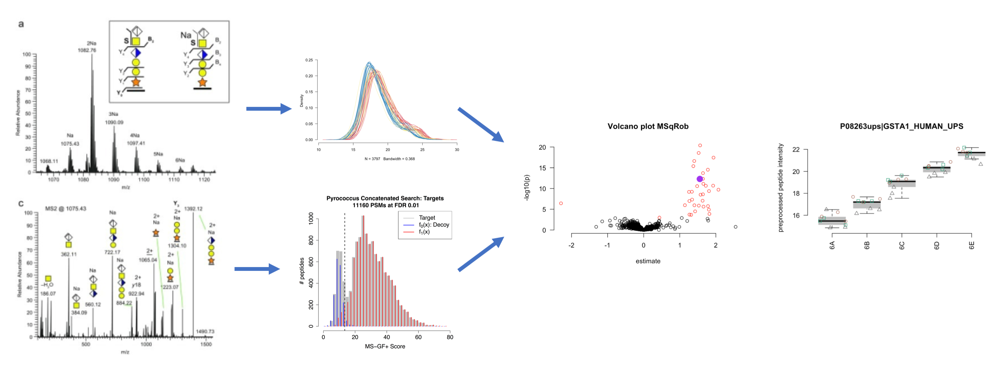

### Course Description
Mass spectrometry based proteomic experiments generate ever larger datasets and, as a consequence, complex data interpretation challenges. In this course, the concepts and methods required to tackle these challenges will be introduced, covering peptide and protein identification, quantification, and differential analysis. Moreover, more advanced experimental designs and blocking will also be introduced. The core focus will be on shotgun proteomics data, and quantification using label-free precursor peptide (MS1) ion intensities. The course will rely exclusively on free and user-friendly software, all of which can be directly applied in your lab upon returning from the course. You will also learn how to submit data to PRIDE/ProteomeXchange, which is a common requirement for publication in the field, and how to browse and reprocess publicly available data from online repositories. The course will thus provide a solid basis for beginners, but will also bring new perspectives to those already familiar with standard data interpretation procedures in proteomics. Note: This is a highly interactive course. It requires that the participants interact with each other and with the course instructors, in order to reach the learning outcomes in full.

### Course Pre-requisites

The participants should have a basic knowledge about mass spectrometry based proteomics. Experience in analysing proteomics data is an advantage, but not mandatory. The course does not require advanced computer skills.

You will also be requested to watch the following videos before attending the course:

- [Lecture mass spectrometry basics - Part 1 - Amino Acids and Proteins (30:46)](https://www.youtube.com/watch?v=bS78rIYvFBE)
- [Lecture mass spectrometry basics - Part 2 - Mass Spectrometry: Concepts and Components. Ion Sources (39:30)](https://www.youtube.com/watch?v=vXsotPtOdRY)
- [Lecture mass spectrometry basics - Part 3 - Mass Spectrometry: Analysers (34:10)](https://www.youtube.com/watch?v=NKXhyjsgT1I)
- [Lecture mass spectrometry basics - Part 4 - Mass Spectrometry: Detectors (19:01)](https://www.youtube.com/watch?v=lxtPIyFnzGk)
- [Lecture mass spectrometry basics - Part 5 - Mass Spectrometry: FCT-IR and Orbitrap (12:55)](https://www.youtube.com/watch?v=rLmpfFjNJd4)
- [Lecture mass spectrometry basics - Part 6 - Tandem Mass Spectrometry (24:54)](https://www.youtube.com/watch?v=Wy1SwrMzhYk)
- [Lecture mass spectrometry basics - Part 7 - A CID Fragmentation Primer (25:37)](https://www.youtube.com/watch?v=JBt_9hBnXcQ)

### Target Audience
This course is oriented towards biologists and bioinformaticians with at least an intermediate level of experience working with omics data. The course will be of particular interest to researchers assessing differential analysis for quantitative proteomics.

---
### Detailed Program

#### 1. [Bioinformatics for Proteomics](https://compomics.com/bioinformatics-for-proteomics/)  

#### 2. Statistical Data Analysis for Proteomics

  2.0. Statistical software [Install and Launch Statistical Software](pages/software4stats.md)  

  2.1. Identification
  - Slides:  [False Discovery Rate and Target Decoy Approach](assets/1_Identification_Evaluation_Target_Decoy_Approach.pdf)
  - Tutorial: [Evaluating Target Decoy Quality](pages/Identification.md)  

  2.2 Statistical Data Analysis of Label Free Quantitative Proteomics Experiments with Simple Designs
  - Slides: [Preprocessing](assets/2_MSqRob_data_analysisI.pdf), [Results of Preprocessing](assets/2_MSqRob_data_analysisIb.pdf)
  - Tutorial: [Statistical Data Analysis with MSqRob for Simple Designs](pages/sdaMsqrobSimple.md)
  - Robust Regression: [Robust Regression Explained by Example](pages/robustRegression.nb.html)  

  2.3. Statistical Analysis of Label Free Quantitative Proteomics Experiments with Factorial Designs
  - Slides: [Statistical Inference](assets/2_MSqRob_data_analysisII.pdf)
  - Tutorial: [Statistical Data Analysis with MSqRob for Factorial Designs](pages/sdaMsqrobDesign.md)

---

##### [Instructors](pages/instructors.md)
