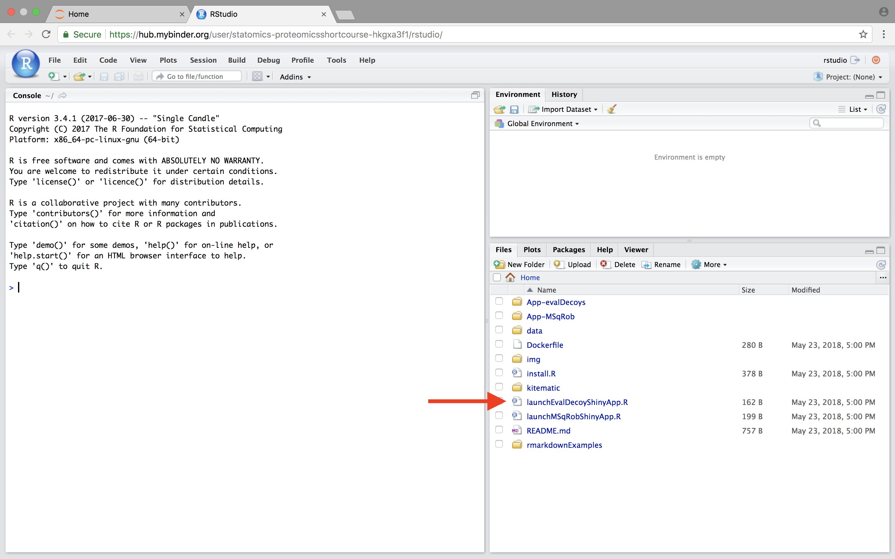
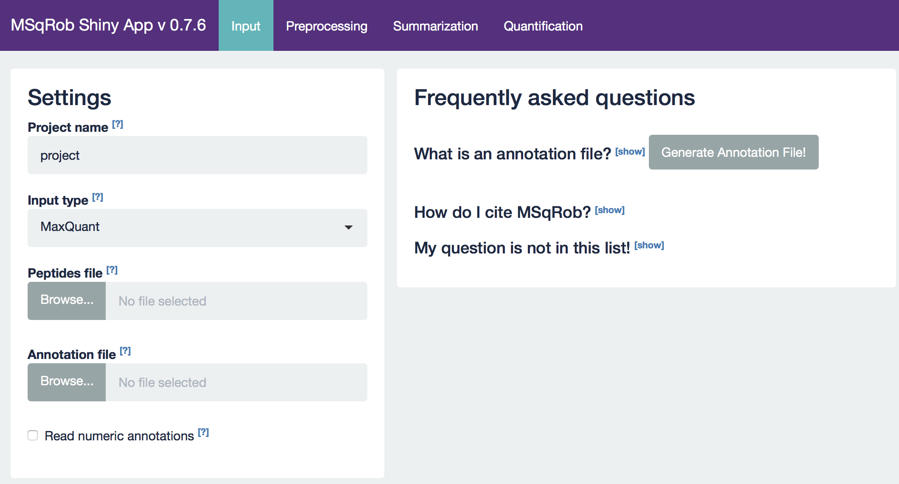

### 2.3. Analysis of more complex designs with MSqRob
The result of a quantitative analysis is a list of peptide and/or protein abundances for every protein in different samples, or abundance ratios between the samples. In this chapter we will extend our generic workflow for differential analysis of quantitative datasets with more complex experimental designs.
In order to extract relevant information from these massive datasets, we will use the MSqRob Shiny GUI, a graphical interface that allows for straightforward data inspection and robust relative protein quantification [1]. The material in this tutorial is partially based on our paper Experimental design and data-analysis in label-free quantitative LC/MS proteomics: A tutorial with MSqRob [2].

#### 2.3.1 Basic Statistical Concepts
The actual design of an experiment strongly impacts the data analysis and its power to discover differentially abundant proteins. Therefore, we first cover some basic concepts on experimental design. Next, we provide a general step-by-step overview of a typical quantitative proteomics data analysis workflow. The monthly column “Points of significance” in Nature Methods is a useful primer on statistical design for researchers in life sciences to which we extensively refer in this section (http://www.nature.com/collections/qghhqm/pointsofsignificance).
For proteomics experiments it is important to differentiate between experimental units and observational units. Experimental units are the subjects/objects on which one applies a given treatment, often also denoted as biological repeats. In a proteomics experiment, the number of experimental units is typically rather limited (e.g. three biological repeats of a knockout and a wild-type sample). The measurements, however, are applied on the observational units. In a shotgun proteomics experiment, these are the individual peptide intensities. For many proteins, there are thus multiple observations/peptide intensities for each experimental unit, which can be considered as technical replicates or pseudo-replicates [3]. Hence, one can make very precise estimates on the technical variability of the intensity measurements; i.e. how strongly intensity measurements fluctuate for a particular protein in a particular sample. However, the power to generalize the effects observed in the sample to the whole population remains limited as most biological experiments typically only have a limited number of biological repeats [4]. We thus strongly advise researchers to think upfront about their experimental design and to maximize the number of biological repeats (we suggest at least three biological repeats, and preferably more).

A very powerful concept in experimental design is that of blocking [5]. In randomized complete block design one randomizes the different treatments to experimental units that are arranged within groups/blocks (e.g. batches, time periods) that are similar to each other. Due to practical constraints, it is often impossible to perform all experiments on the same day, or even on the same HPLC column or mass spectrometer, leading to unwanted sources of technical variation. In other experiments, researchers might test the treatment in multiple cultures or in big experiments that involve multiple labs. A good experimental design aims to mitigate unwanted sources of variability by including all or as many treatments as possible within each block. That way, variability between blocks can be factored out from the analysis when assessing treatment effects (Figure 1). It is of prime importance that all treatments are present within each block, otherwise confounding can occur between the treatment and block e.g. (Figure 1).

Figure 1. Example of a good (A) and a bad (B) design. In design A, both the green and orange treatments are divided equally within each block. That way, the treatment effect can be estimated within a block. In design B, each block contains only one treatment, so the treatment effect is entirely confounded with the blocking effect and it is thus impossible to draw meaningful conclusions on the treatment (unless one would be willing to assume that the blocking effect is negligible, which is a very strong assumption that cannot be verified based on the design).

#### 2.3.2 Starting MSqRob

When working with the online binder version, hit the binder button below:

Now an interactive statistical programming environment will open that is running on a cloud server. In this tutorial we will not make use of the powerful R-scripting environment, but we will launch an App with a GUI instead. Open the launchMSqRobShinyApp.R file by clicking on the file in the bottom right panel.

A novel panel opens in the topleft. Click on runApp to launch the EvalDecoy app.

The MSqRob App is launched:

*Hint: Click on the question marks to get extra information about an input field.*

#### 2.3.3 Evaluating the impact of sample size
18 Estrogen Receptor Positive Breast cancer tissues have been analyzed that originate from from patients treated with tamoxifen upon recurrence, 9 with good outcome (or) and 9 with poor outcome (pd).
The proteomes have been assessed using an LTQ-Orbitrap  and the thermo output .RAW files were searched with MaxQuant (version 1.4.1.2) against the human proteome database (FASTA version 2012-09, human canonical proteome).

We provided 3 peptides txt files.

1. For a 3 vs 3 comparison
2. For a 6 vs 6 comparison
3. For a 9 vs 9 comparison

The data can be found at https://github.com/statOmics/pdaData
in the folder data/quantification/cancer

Perform an MSqRob analysis for each peptide file. What is the impact of the sample size on the results?
Explain why.

#### 2.3.4. Blocking: CPTAC dataset

The 6th study of the Clinical Proteomic Technology Assessment for Cancer (CPTAC). In this experiment, the authors spiked the Sigma Universal Protein Standard mixture 1 (UPS1) containing 48 different human proteins in a protein background of 60 ng/μL Saccharomyces cerevisiae strain BY4741 (MATa, leu2Δ0, met15Δ0, ura3Δ0, his3Δ1). Five different spike-in concentrations were used: 6A (0.25 fmol UPS1 proteins/μL), 6B (0.74 fmol UPS1 proteins/μL), 6C (2.22 fmol UPS1 proteins/μL), 6D (6.67 fmol UPS1 proteins/μL) and 6E (20 fmol UPS1 proteins/μL) [6]. The raw data files can be downloaded from https://cptac-data-portal.georgetown.edu/cptac/public?scope=Phase+I (Study 6). We limited ourselves to the data of LTQ-Orbitrap at site 86, LTQ-Orbitrap O at site 65 and LTQ-Orbitrap W at site 56. The data were searched with MaxQuant version 1.5.2.8, and detailed search settings were described in Goeminne et al. (2016) [1]. The experiment is conceived as a randomized complete block design with lab as a blocking factor. For every lab, 3 replicates are available for each concentration.

The data can be found in the folder data/quantification/cptac

##### 2.3.4.1. Which factors will you use in the mean model?

##### 2.3.4.2. Evaluation of contrasts of interest. We would like to perform all pairwise comparisons between each of the treatments. How many contrasts do we need for this, specify each contrast

##### 2.3.4.3. Interpret the log 2 transformed fold change for the top hit of the comparison involving treatment B vs A.

##### 2.3.4.4. What do you observe for the comparisons involving treatment D and/or E? Can you explain this?
