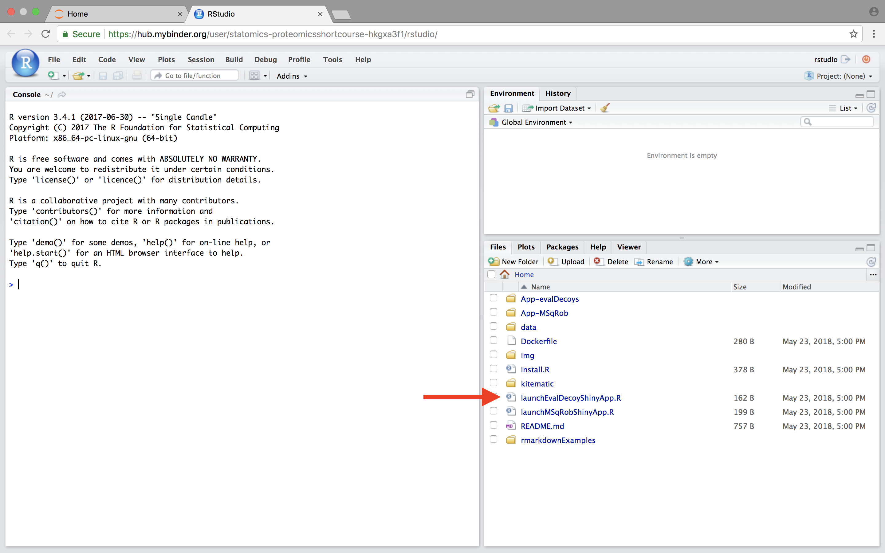

<script src="https://cdnjs.cloudflare.com/ajax/libs/mathjax/2.7.0/MathJax.js?config=TeX-AMS-MML_HTMLorMML" type="text/javascript"></script>

### 2.2. Statistical analysis with MSqRob for simple designs
The result of a quantitative analysis is a list of peptide and/or protein abundances for every protein in different samples, or abundance ratios between the samples. In this chapter we will describe a generic workflow for differential analysis of quantitative datasets with simple experimental designs.
In order to extract relevant information from these massive datasets, we will use the MSqRob Shiny GUI, a graphical interface that allows for straightforward data inspection and robust relative protein quantification [1]. The material in this tutorial is partially based on our paper Experimental design and data-analysis in label-free quantitative LC/MS proteomics: A tutorial with MSqRob [2].

#### 2.2.1 Basic Statistical Concepts
The actual design of an experiment strongly impacts the data analysis and its power to discover differentially abundant proteins. Therefore, we first cover some basic concepts on experimental design. Next, we provide a general step-by-step overview of a typical quantitative proteomics data analysis workflow. The monthly column “Points of significance” in Nature Methods is a useful primer on statistical design for researchers in life sciences to which we extensively refer in this section (http://www.nature.com/collections/qghhqm/pointsofsignificance).
For proteomics experiments it is important to differentiate between experimental units and observational units. Experimental units are the subjects/objects on which one applies a given treatment, often also denoted as biological repeats. In a proteomics experiment, the number of experimental units is typically rather limited (e.g. three biological repeats of a knockout and a wild-type sample). The measurements, however, are applied on the observational units. In a shotgun proteomics experiment, these are the individual peptide intensities. For many proteins, there are thus multiple observations/peptide intensities for each experimental unit, which can be considered as technical replicates or pseudo-replicates [3]. Hence, one can make very precise estimates on the technical variability of the intensity measurements; i.e. how strongly intensity measurements fluctuate for a particular protein in a particular sample. However, the power to generalize the effects observed in the sample to the whole population remains limited as most biological experiments typically only have a limited number of biological repeats [4]. We thus strongly advise researchers to think upfront about their experimental design and to maximize the number of biological repeats (we suggest at least three biological repeats, and preferably more).

#### 2.2.2 Starting MSqRob

When working with the online binder version, hit the binder button below:

[](http://mybinder.org/v2/gh/statOmics/pda/master?urlpath=rstudio)

Now an interactive statistical programming environment will open that is running on a cloud server. In this tutorial we will not make use of the powerful R-scripting environment, but we will launch an App with a GUI instead. Open the launchMSqRobShinyApp.R file by clicking on the file in the bottom right panel.



A novel panel opens in the topleft. Click on runApp to launch the EvalDecoy app.


The MSqRob App is launched:


*Hint: Click on the question marks to get extra information about an input field.*

### 2.2.3 The CPTAC A vs B dataset lab 3

Our first case-study is a subset of the data of the 6th study of the Clinical Proteomic Technology Assessment for Cancer (CPTAC). In this experiment, the authors spiked the Sigma Universal Protein Standard mixture 1 (UPS1) containing 48 different human proteins in a protein background of 60 ng/μL Saccharomyces cerevisiae strain BY4741 (MATa, leu2Δ0, met15Δ0, ura3Δ0, his3Δ1). Two different spike-in concentrations were used: 6A (0.25 fmol UPS1 proteins/μL) and 6B (0.74 fmol UPS1 proteins/μL) [5]. The raw data files can be downloaded from https://cptac-data-portal.georgetown.edu/cptac/public?scope=Phase+I (Study 6), the processed data can be downloaded by zipping the github repository https://github.com/statOmics/pdaData, in the folder data/quantification/cptacAvsB_lab3. We limited ourselves to the data of LTQ-Orbitrap W at site 56. The data were searched with MaxQuant version 1.5.2.8, and detailed search settings were described in Goeminne et al. (2016) [1]. Three replicates are available for each concentration.

### 2.2.3.1. The Input tab

Our first step is to choose an appropriate name for the project. This name, appended with a timestamp, will be used when downloading results from the analysis. Here, we use the name “project_CPTAC_AvsB”.
Next, upload your peptides.txt file. This is the file that contains your peptide-level intensities. For a MaxQuant search [6], this peptides.txt file can be found by default in the “path_to_raw_files/combined/txt/” folder from the MaxQuant output, with “path_to_raw_files” the folder where raw files were saved. In this tutorial, we will use a MaxQuant peptides file from MaxQuant that can be found on the pdaData repository.
Similarly, upload the experimental annotation file which is called “label-free_CPTAC_annotation.xlsx”. This file should always be a tab-delimited file or an Office Open XML spreadsheet file (“.xlsx” file). Figure 4. shows how this file looks like for our experiment. One column (the “run” column in Fig. 3) of the experimental annotation file should always contain the names of the MS runs. For MaxQuant, these are the names given in the “Experiment” column when the data was searched. The names should be unique. Other columns indicate other variables related to the design that can affect protein expression; here this is only the treatment/spike-in condition.


Experimental annotation file have a typical structure. For the CPTAC dataset analyzed with MaxQuant, the first column equals the names given in MaxQuant’s “Experiment” column. Other columns indicate other variables related to the study design. Here it is only the treatment (“spike-in condition”).

*Hint: If the file location was already specified and the peptides file was uploaded, you can generate the “run” column of this file automatically in the output folder by clicking the “Create annotation file” button. The other columns need to be filled in manually based on the experimental design.*

After setting your output location and uploading your files, your input screen should look as follows:


At this stage, everything is set for preprocessing and data exploration, which are implemented in the preprocessing tab.

#### 2.2.3.2. The Preprocessing tab
The preprocessing tab features different preprocessing options, many of which can be safely left at their default state. When you click the preprocessing tab, it should now look as follows:


For MaxQuant data exclusively, there is an option to “Remove proteins only identified by site”. This allows for removing proteins that are only identified by peptides that carry one or more modified amino acids. Identification of such peptides in the background of non-modified peptides is often less reliable, and proteins only identified by such peptides are therefore removed in a typical MaxQuant-Perseus workflow. We offer the option to do a similar filtering in MSqRob. The MaxQuant's proteinGroups.txt file  is needed for this purpose. By default, this file can be found in the “combined/txt/” folder.
This file can be found on the pdaData repository.
After uploading the proteinGroups.txt file, a diagnostic plot is produced for the raw data upon log-transformation. Select “condition” as the color variable. The diagnostic plots are now colored according to spike-in condition.


The other normalization steps are performed upon hitting the “Do Normalization” button on the bottom of the Normalization tab. This is required to generate the normalized peptide object that is needed in the other panels of the app. Now, two additional plots are generated: the second plot shows the distributions of the peptides intensities In each runs after normalization and the third plot is an MDS plot. An MDS plot is a scatter plot that shows the runs in such a way that the distances on the plot are equal to the Euclidian distances of the top 500 most differing peptides between each pair of runs. Thus, runs that are plotted close to each other are more similar than samples that are far away from each other. Options are provided to show only dots, only labels or both. It is also possible to zoom in on a particular part of the plot by dragging the mouse to select a particular area on the plot and then double-click to zoom in.


The first preprocessing step is log-transformation.
Why is log-transformation needed? (Hint: untick the checkbox before “Log-transform data” and see what happens to the data distribution.) [2.3.2.a]

Why do we choose base 2? (Hint: think of the interpretation later on!) [2.3.2.b]
The next step is normalization. It is difficult to propose a one-size-fits-all normalization because the nature and extent of bias in the data are generally unknown. Thus, relative performance of different normalization methods might be different in different datasets [8].

Why do we normalize our data? [2.3.2.c]
In order to see the effects of different normalization approaches, select “lab” as the color variable in the right panel. Try changing the normalization to center “median” and “vsn” and see what happens. The impact of the different methods is not that large, but it will become more important in the other examples. For this tutorial, we will choose quantile normalization (“quantiles”).

What is quantile normalization? [2.3.2d]

What do you conclude based on the MDS plot after quantile normalization (see also Fig. 4)? [2.3.2e]

Razor peptides are peptides that cannot be uniquely attributed to a single protein or protein group. As we are uncertain from which protein group these peptides originate and their intensities might even be a combined value from multiple protein groups, we opt to remove these peptides by default. The option “Remove comprising protein groups” deals with peptides that are shared between protein groups.  This option removes all peptides in protein groups for which any of its peptides map to a protein that is also present in another smaller protein group.

“Minimal number of peptides” indicates a threshold T for how many times a certain peptide sequence should be present in the data before being retained in the final analysis. Peptides that are identified at least T times are retained; other peptides are removed from the data. This value defaults to 2 and there is a very practical reason for this. Indeed, we need a parameter in the model for each peptide sequence. Adding a parameter for a single observation leads to perfect confounding in the model as there is no way to discern between the peptide-specific effect and the other effects for this observation. Note that this is not the same as applying the so-called “two-peptide rule” [9]. A protein identified by only one peptide can contribute to the estimation provided that the peptide is identified in multiple samples.

You can further filter out reverse sequences (left over from the MaxQuant search) and potential contaminants proteins (such as keratin from the operator's skin and hair, or leftover trypsin from digestion) [10], by providing the column names of the peptides file that indicate these sequences in the “Filter columns” field.

#### 2.2.4.3. The Summarization tab
The preprocessing tab features different summarization options. When you click the preprocessing tab, the following screen is obtained:


When no summarization is selected a regular MSqRob analysis can be conducted starting from peptide intensities. When robust summarization is applied, the novel and much faster two-stage approach is used to fit the MSqRob model. Mean and median summarization are also implemented, but mainly for didactical reasons and to show the problems related to naive summarization methods. You always have to invoke the “Start Summarization!” button in order to create an object needed for downstream quantification. Depending on the method, summarization might take a while.

We first select the naive median summarization method and hit the “Start Summarization!” button. When the summarization is finished an MDS plot is generated based on the summarized intensities. There also appears a download button to download the summarized values in an excel file. Download the protein summaries by clicking on the “Download protein intensities” button. A project_CPTAC_AvsB_Timestamp_ProteinSummaries.xlsx files is generated in your Web Browser’s default download folder. We mainly will do this to illustrate the pitfalls of naive summarization methods.


We then select the robust method, which we will use in the downstream data analysis method so as to implement the two-stage MSqRob procedure. Also download the summarization results.

What do you see upon summarization with the robust method and why would that be the case? [2.3.3.a]

##### Intermezzo: Evaluate Summarization.
We further explore the difference between summarization methods.
Close the GUI and go back to the rstudio window.
If the console is still active you can hit the stop buttom at the lower left panel.

Click on the folder "rmarkdownExamples" in the right panel and open the file assessFoldChangesMaxLFQ.Rmd.


Click on the upload button to upload summarized data. We will first upload the maxLFQ summarization values. They can be found on
the downloaded data folder proteomicsShortcourseData > data > quantification > cptacAvsB_lab3 > lfqSummariesLab3.xlsx.

Now the data and the script are present in rstudio.
In R studio, we make use of an R book, which enables us to weave text and R code.
The R book can be adaptively expanded so that you can document your analysis.
Every data analysis step is carried out in an R chunk, which starts with
```{r}
```

First hit the preview button and an html file will appear.
The chunks can be excuted by pushing the git button.
The html will now be updated if you save the R book.
If you add text and save the result, the boot is again updated.


[2.3.3.a] Open your summarized expression value file for the median summarization (file with earliest time stamp). Calculate the average summarized log expression values for both treatments, the log Fold Change (difference between average summarized log expression value in treatment B and A) and make a box plot of the Fold Changes.
Repeat this for the robust summarization method.
Compare the MaxLFQ, median and robust summarization methods. What do you observe and try to explain this.

##### 2.2.3.4. The Quantification tab

The fixed effects need to be specified. Fixed effects are those effects for which all levels of interest are included in the experiment. They remain constant when repeating the experiment.
For factor variables (e.g. genotype), the number of levels are typically small. Examples include genotype (when comparing specific genetic constitutions), treatment, gender (only two levels), … You should select “treatment” as a fixed effect, because it is the main effect of interest and it has a fixed number of levels, being one for each spike-in concentration. Effects of interest are nearly always fixed effects.
The study does not contain random effects, so they can be left unspecified.
MSqRob also exploits the link between ridge regression and mixed models [1].
Ridge regression is implemented to prevent overfitting.
Ridge regression, however, is considerably slower so for the exercises we will switch of ridge regression by selecting “No”.

Set the “Number of contrasts” to 1. Contrasts are linear combination of the parameters in the model that quantify the effect of interest. In our case we model the data with a linear model that contains to parameters: a mean for every treatment group. We aim to compare the log average for the two treatment groups. So we only have one contrast of interest. Remember that we log-transformed the intensities:

$$ log_2⁡FC=log_2⁡6B-log_2⁡6A=log_2⁡ \frac{6B}{6A} $$

This contrast has the interpretation of a log2 fold change between condition 6B and condition 6A. Positive estimates denote that the abundance of the protein is on average higher in condition 6B, negative estimates denote that the abundance is on average higher in condition 6A. An estimate equal to 0 indicates that the estimated abundances are equal. A log2 FC = 1 indicates that the average abundance in condition B is 2 x higher than the average abundance in condition A, i.e. an 2 fold upregulation in condition B as compared to condition A.
In order to specify the contrast of interest in MSqRob we set condition 6A to − 1 and condition 6B to 1. That way, we subtract the average log2 intensity in condition 6A from that in condition 6B.
In the statistical analysis we will then test the null hypothesis that

$$ H0: log_2 ⁡6B-log_2 ⁡6A = 0 $$

Against the alternative that
$$ H0: log_2 ⁡6B-log_2 ⁡6A =\neq0 $$

And we will falsify this null hypothesis for each protein separately. So, under the null hypothesis we reason that there is no effect of the spike-in treatment on the abundance of a specific protein. T
he p-value of the statististical test than indicates the probability to observe an effect (fold change), that is as extreme or more extreme (equally or more up or down regulated) than what is observed in the sample, by random change (when the null hypothesis is true and when there is in reality no effect of the treatment).

What is the difference between setting 6B to 1 and 6A to -1 versus setting 6B to -1 and 6A to 1? [4.6.4f]

Press the “Start the analysis!” button and wait for the analysis to complete.

Click on some dots in the Volcano plot to see the underlying data. You can again use color variables and shape variables to get an insight in the protein summaries in the different conditions.
Select an area on the plot and double click to zoom in. Double click on an unselected area to reset the plot window. Selecting a protein in the “Results table” results in selecting it on the Volcano plot.

*Hint: The results can be saved. Open the file “project_Timestamp_CPTAC_AvsB_results.xlsx” in the default download folder of your browser*

#### 2.2.4 The Francisella dataset
A study on the facultative pathogen Francisella tularensis was conceived by Ramond et al. (2015) [12]. F. tularensis enters the cells of its host by phagocytosis. The authors showed that F. tularensis is arginine deficient and imports arginine from the host cell via an arginine transporter, ArgP, in order to efficiently escape from the phagosome and reach the cytosolic compartment, where it can actively multiply. In their study, they compared the proteome of wild type F. tularensis (WT) to ArgP-gene deleted F. tularensis (knock-out, D8). For this exercise, we use a subset of the F. tularensis dataset where bacterial cultures were grown in biological triplicate and each sample was run on a nanoRSLC-Q Exactive PLUS instrument. The data were searched with MaxQuant version 1.4.1.2.
The data can be found on https://github.com/statOmics/pdaData

##### 2.2.4.1. The Input tab
Restart MSqRob GUI. The MSqRob settings for the Francisella dataset are very similar to the settings for the CPTAC dataset. Use the name “project_Francisella”. Next, upload the peptides.txt file from
data/quantification/francisella on the pdaData repository.

Generate your own experimental annotation file by clicking the Generate Annotation File tab in the right panel of the input tab. Once it is generated a new button appears to download the annotation file.

Upon clicking the “Download Annotation Button” an excel file with your project name “francisella_timestamp_experimental_annotation.xlsx” is downloaded to your browsers’ default download folder.

The excel file contains a row named run that includes the names of all runs that are included in the peptides.txt file. We now have to complete the file with information on the experimental design of the study. In our case, we only need to include one additional column with the genotype of the study (wild type, WT or knock out, D8). Once this has been done, you can use your experimental annotation file for your analysis.

##### 2.2.4.2. The Preprocessing tab
The preprocessing part is analogous as for the CPTAC example.

##### 2.2.4.3. The Summarization tab

The summarization part is analogous as for the CPTAC example.

##### 2.2.4.4. The Quantification tab

We again group by “Proteins”. The “Annotation columns” field allows retaining extra annotation columns that one might have added to the peptides file. Add “Protein names” and “GI number” to the “Annotation columns” field.

Which contrast do we want to test now? [2.4.4a]

Give the interpretation of the contrast for your top hit? [2.4.4b]
