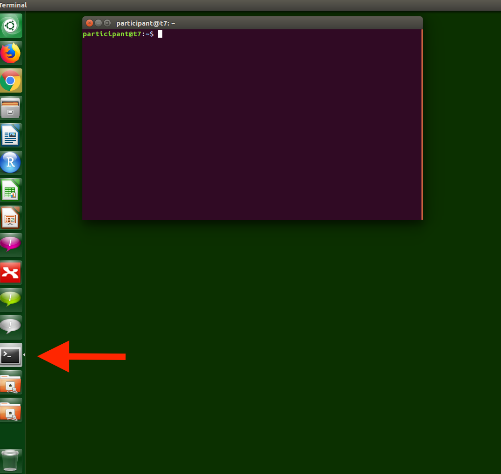

There are three options to work with the software:

1. Using an online binder docker environment that launches R studio immediately.
2. Using an online binder docker environment that launches a Jupyter binder environment.
3. Using an offline docker that launches a Jupyter environment.

#### Getting started

1. Launch an R studio interface in an R docker along with bioconductor packages for proteomics.

[](http://mybinder.org/v2/gh/statOmics/proteomicsShortCourse/master?urlpath=rstudio)

2. Alternatively, you can launch R studio via the jupyter binder environment:

[](http://mybinder.org/v2/gh/statOmics/proteomicsShortCourse/master)

Once inside Jupyter Notebook, RStudio Server should be an option under the menu
"New":


3. You can install your own local docker by downloading the entire repository and invoking
```
docker build <path to proteomicsShortCourse directory> -t msqrob_docker
```

#### Install the Docker on local machines at GBTP.

Tentative for participants at GBTP.
In the PC-roams the docker is available on the share.
You only have to install the docker  do that once for every machine.

1. Open a terminal


2. type

```
sudo docker load -i /media/gtpb_shared_drive/To_Participant/statsDocker/msqrob_docker.tar
```

You have to run the command as a super user (sudo) because normal users do not have the permission to launch docker on the PCs in the tutorial roam.
The `docker` command launches docker.
The `load` command will enable a new docker to be installed locally.
The switch `-i` stand for input
Then we give the full path to the docker, which is available on the share.


Now the docker installations starts.

#### Launch the Docker

1. Open a terminal

2. Launch the docker by typing the command.

```
sudo docker run -p 8888:8888 msqrob_docker
```

You have to run the command as a super user (sudo) because normal users do not have the permission to launch docker on the PCs in the tutorial roam.
The `docker` command launches docker.
The `run` command enables you to launch a Docker.
The `-p 8888:8888` command is used to listen to port 8888 of the docker and to pipe it to the port 8888 on the local machine.
The will enable us to view the jupyter server in the Docker via a webbrowser.

We can interact with the docker via a web browser.

3. Open Firefox


A new window will appear where you have to fill a the token.
You can copy the link token from the terminal.
Here, it was,
```
http://c924e5fb54b5:8888/?token=dd01e2e228d8200e8e2cba2f8fff2a9396f4c22b9068c4d5&token=dd01e2e228d8200e8e2cba2f8fff2a9396f4c22b9068c4d5
```

we first replace the machine name `c924e5fb54b5` by localhost and paste the adjusted adress in the browser.
```
http://localhost:8888/?token=dd01e2e228d8200e8e2cba2f8fff2a9396f4c22b9068c4d5&token=dd01e2e228d8200e8e2cba2f8fff2a9396f4c22b9068c4d5
```


Note, that copying in linux is possible via highlighting text. Pasting can be done by pushing the middle mouse button.


Press enter! Then the jupyter hub environment will launch.


Select New>Rstudio Session to launch the statistical software R.
Now an interactive statistical programming environment will open in the browser that runs on a cloud server.

#### Close the Docker

Only if you work with a local Docker.
1. Close RStudio
2. Log off the jupyter environment
3. Open a new terminal and type the command

```
sudo docker stop c924e5fb54b5
```
where you replace `c924e5fb54b5` with the name of your docker.
